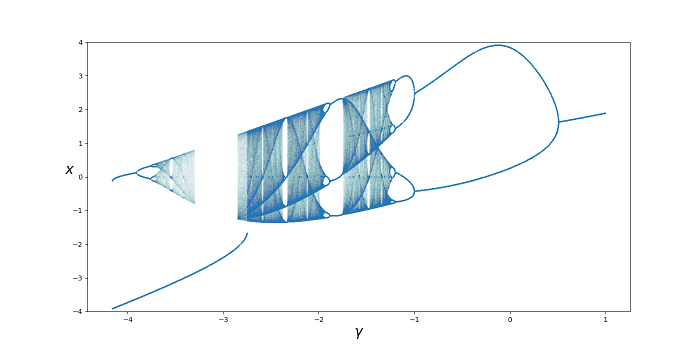
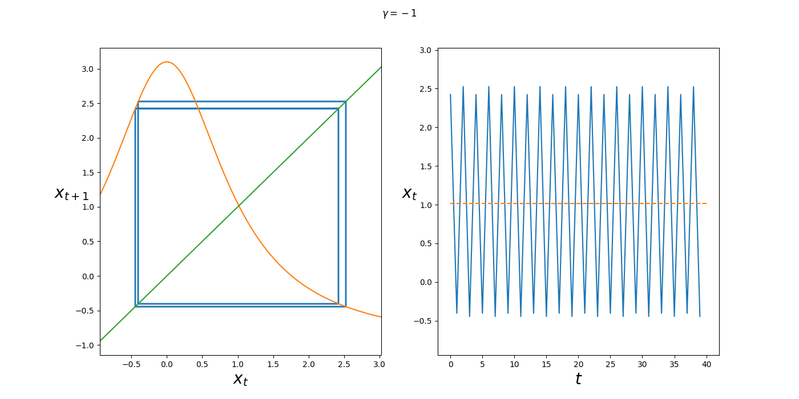
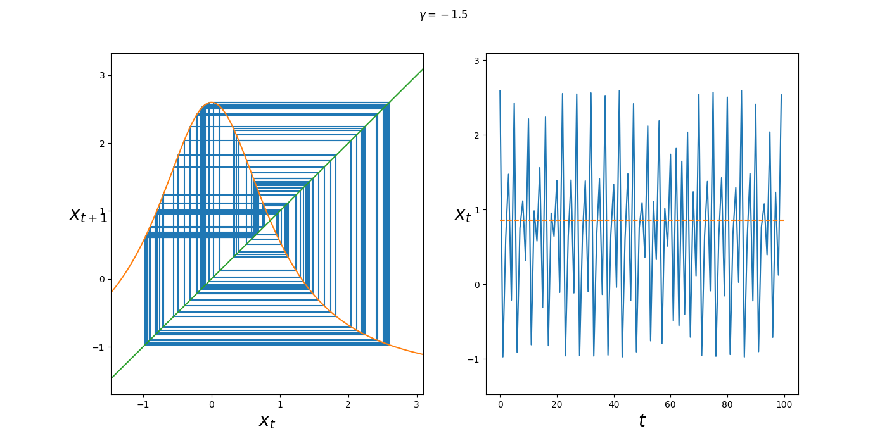

# Диплом

## 1. Введение

Моделирование нейронных сетей с помощью дискретных моделей имеет вычислительные преимущества перед использованием непрерывных систем, потому что их проще итерировать.

Цель: провести анализ модели нейрона Рулькова. Узнать, как синхронизируется система, насколько чувствительна синхронизация к стахостическому шуму.

## 2. Анализ детерминированной одномерной модели Рулькова

Рассмотрим детерминированный вариант одномерной модели Рулькова

$$x_{t + 1} = f_{\gamma}(x_t) = \frac{\alpha}{1 + x_t ^ 2} + \gamma.$$

Здесь $x$ – мембранный потенциал, $\gamma$ – параметр концентрации ионов, $\alpha$ - парметр нелинейности системы

Зафиксируем $\alpha = 4.1$, так как при таком значении происходят хаотические всплески активности нейрона. В изначальной формулировке $\gamma$ - медленная переменная в модели, но ее изменения настолько малы, что динамику $x$ можно рассматривать независимо от изменений медленной переменной.

Найдем точки покоя, то есть точки, в которых состояние нейрона не меняется.
Для данной модели точки покоя – решения уравнения

$$x = \frac{\alpha}{1 + x ^ 2} + \gamma.$$

$$(x - \gamma)(1 + x ^ 2) = \alpha$$

$$x^3 - \gamma x ^ 2 + x - (\gamma + \alpha) = 0$$

Если для каждого $\gamma$ построить точки покоя системы, множество этих точек будет иметь вид транспонированного графика

$$\gamma = g(x) = x - \frac{\alpha}{1 + x ^ 2}.$$

На рисунке выше изображены координаты точек покоя для $\gamma$ на отрезке $[-4, 1]$. Точки покоя являются корнями уравнения третьей степени, поэтому в системе их не может быть больше трех.

Оранжевым отмечены точки перегиба - границы параметра системы, при котором имеют место несколько точек покоя. Точки перегиба имеют координаты $(x_0, \gamma_0) = (-1.62956, -2.75117)$ и $(x_1 , \gamma_1) = (-0.12584, -4.16187)$. Их можно найти, решив уравнение:

$$g_x'(x)=(x - \frac{\alpha}{1 + x ^ 2})_x'=0.$$

$$1 + \frac{2 \alpha x}{(1 + x ^ 2)^2}=0$$

$$(1 + x ^ 2)^2= - 2 \alpha x$$

$$x^4 + 2 x ^ 2 + 2 \alpha x + 1 = 0$$

### 2.1 Бифуркационный анализ системы

Рассмотрим бифуркационную диаграмму системы (1).
Бифуркационная диаграмма показывает значения, к которым стремится система в зависимости от параметра. С ее помощью можно исследовать равновесные, асцеляционные режимы, как регулярные, так и хаотические.

На рисунке выше можно увидеть расположение аттрактора. Он присутствует в системе при параметрах $\gamma \in (-\infty, -2.75117)$ и совпадает с одной из точек покоя. Его координата принимает значения в интервале $(-\infty, -1.62956)$.

Выше на графике расположены зоны k-циклов и хаоса. Зона хаоса прерывается при $\gamma \in (-3.3, -2.85).$ На интервалах $(-3.9117, -3.7612)$ и $(-1, 0.508)$ можно заметить 2-циклы. Когда $\gamma \in (-1.75, -1.875)$ система стабилизируется в 3-цикле.

На этом рисунке были добавлены пунктирной линией точки покоя. Теперь из рисунка выше видно, что точки покоя, расположенные между точками перегиба, отталкивают от себя систему, то есть являются репеллером. Зона хаоса прерывается, когда ее область касается репеллера.

Через зону хаоса проходит точка покоя, которая на интервале $(-3.9117, 0.508)$ перестает быть аттрактором и начинает отталкивать точки.

## 2.2 Анализ устойчивости системы

Показатель Ляпунова – распространенный инструмент для определения устойчивости точек системы.

$$\lambda_{x_0}(\gamma) = \lim_{n \rightarrow \infty }\frac{1}{n} \ln |(f_{\gamma}^{n} (x_0))'|$$

Если $\lambda_{x_0}(\gamma) < 0$, то процесс осуществляет периодический режим с циклом некоторого порядка. Если $\lambda_{x_0}(\gamma) = 0$, то это соответствует режиму бифуркации, то есть удвоению периода. Если $\lambda_{x_0}(\gamma) > 0$, то поведение системы отталкивающее или хаотическое.

$f_{\gamma}^{n} (x_0)$ – $n$ композиций функции $f_{\gamma}$.

$$(f_{\gamma}^{n} (x_0))' = \prod_{t=0}^{n-1} f_{\gamma}'(x_t)$$

Доказать факт выше можно по индукции по $n$.

Теперь показатель Ляпунова принимает вид

$$\lambda_{x_0}(\gamma) = \lim_{n \rightarrow \infty }\frac{1}{n} \ln |\prod_{t=0}^{n-1} f_{\gamma}'(x_t)|.$$

Из логарифма произведения получается сумма логарифмов:

$$\lambda_{x_0}(\gamma) = \lim_{n \rightarrow \infty }\frac{1}{n} \sum_{t=0}^{n-1} \ln |f_{\gamma}'(x_t)|.$$

Данный вид лучше применим при вычислениях, потому что ошибка при умножении копится быстрее, чем при сложении. Он применим в общем случае, в точках покоя, k-циклах и зонах хаоса.

В точках покоя показатель Ляпунова принимает упрощенный вид: 

$$\lambda_{x}(\gamma) = \ln |f_{\gamma}'(x)|,$$

потому что $x_0 = x_1 = ... = x_n = ...$.

$$f_{\gamma}'(x) = 
    (\frac{\alpha}{1 + x ^ 2} + \gamma)' =
    - \frac{2 \alpha x}{(1 + x^2)^2}$$

График для показателя Ляпунова может содержать до четырех значений (включительно) для одного значения $\gamma$, потому что в один момент может быть три точки покоя и зона хаоса/k-цикл.

Оранжевая линия на графике соответствует аттрактору на бифуркационной диаграмме, ее показатель меньше нуля, система в устойчивом состоянии покоя.
Зеленая линия соответствует точкам покоя между точками перегиба, для них показатель Ляпунова больше нуля, так как они отталкивают от себя систему.
Красная линия для оставшихся точек покоя принимает значения с обоих сторон от нуля, так как с изменением параметра она теряет свою устойчивость. Красная линия сильно уходит вниз при $\gamma = -4.1 = -\alpha$, так как в этом случае точка покоя находится в $x = 0$ и $f_{\gamma}'(0) = 0$.

## 2.3 Лестницы Ламерея

На рисунках с 5 по 11 приведены фазовые портреты при определенных значениях $\gamma$. Слева изображена лестница Ламерея, биссектриса $y = x$ и график функции $f_{\gamma}$. Справа ломанными изображены временные ряды, а пунктирной линией точки покоя системы.

Из временного ряда видно, что при $\gamma = 1$ и начальной точке $x_0 = 0$ решение монотонно сходится к равновесию в точке $x \approx 1.89388$.

На бифуркационной диаграмме можно увидеть не только зоны моно-стабильности, но и k-циклы.

При параметре $\gamma = -0.1$ в системе формируется 2-цикл, при этом единственная точка покоя лежит между решениями системы: $x_1 \approx 0.15203, x_2 \approx 3.90737$.

При уменьшении параметр $\gamma$ происходит удвоение периода цикла. В системе имеет место 4-цикл.

После нескольких бифуркаций удвоения периода система переходит в режим хаотического блуждания.

При дальнейшем увеличении $\gamma$ в хаотическом режиме системы появляются длинные участки стабильности, пережимаемые хаотическими всплесками.

После зоны хаоса в системе снова наступает периодическое поведение. В данном режиме период не являет степенью двойки, что отличает его от предыдущего периодического режима. Значения, между которыми переключается система: 
$x_1 \approx -0.02865, x_2 \approx 2.29664, x_3 \approx -1.14657$.

При дальнейшем уменьшении $\gamma$ в системе появляются новые точки покоя, что усложняет поведение нейрона. Видно почему зона хаоса прерывается. Это происходит, потому что при хаотическом блуждании, состояние нейрона оказывается по другую сторону от репеллера, после чего решение системы устремляется к аттрактору.

Рассмотрим значение параметра $\gamma$, когда в системе присутствует и хаотическое блуждание и моно-стабильность. При таком $\gamma$ хаотическое блуждание не проходит через границу репеллера, хоть и приближается к нему сколь угодно близко, при этом задерживаясь у него на некоторое время.

